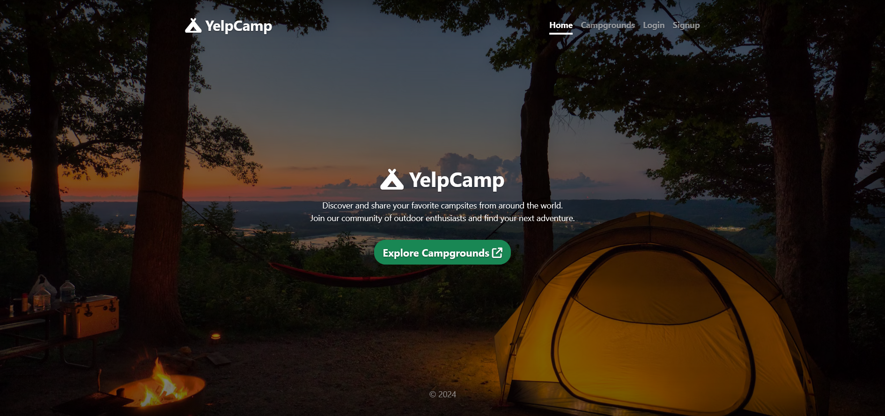
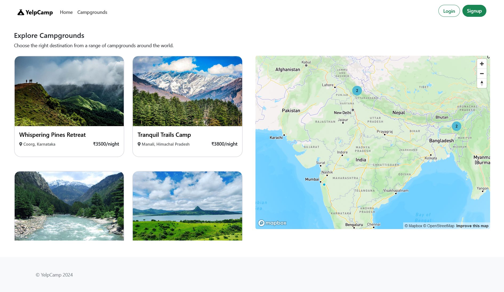
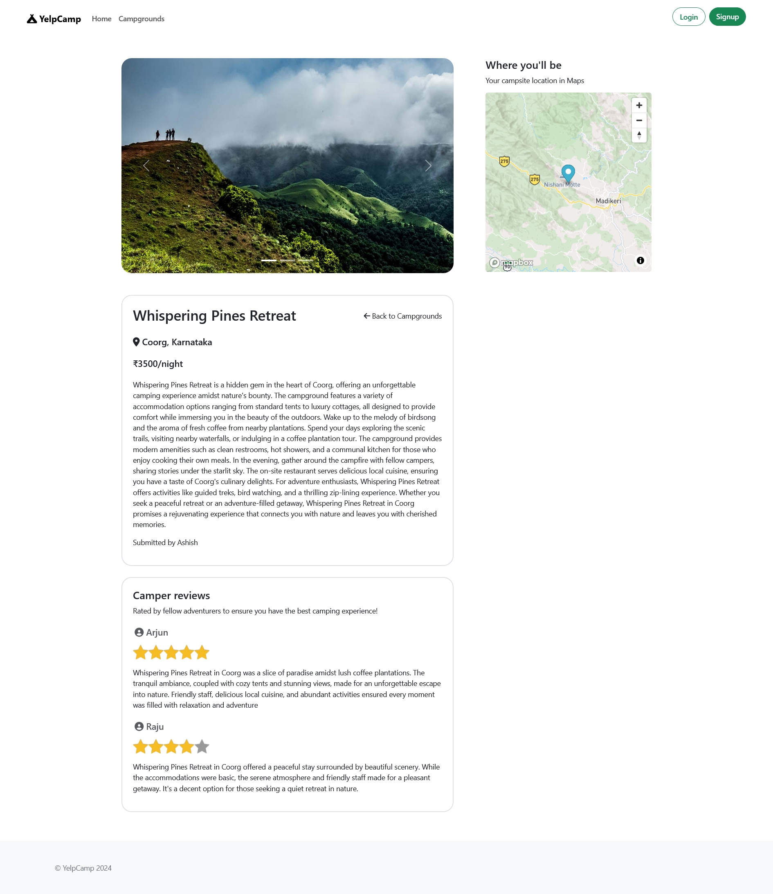

# YelpCamp

Welcome to YelpCamp! This is a full-stack web application that allows users to view, create, and review campgrounds. Whether you're an avid camper looking for your next adventure or a campground owner wanting to showcase your site, YelpCamp has you covered.

## ✨ Features

- **Browse Campgrounds**: View a list of campgrounds uploaded by users.
- **Campground Details**: Click on a campground to see more details, including reviews and ratings.
- **User Authentication**: Sign up or log in to your account to access additional features like adding new campgrounds and leaving reviews.
- **Add New Campgrounds**: Logged-in users can add new campgrounds to the platform, complete with images and descriptions.
- **Leave Reviews**: Users can leave reviews for campgrounds, sharing their experiences and recommendations.
- **Edit and Delete**: Users can edit or delete their campgrounds and reviews.

## 📸 Screenshots

<!--  -->

## 🛠️ Technologies Used

- **Node.js**: Backend JavaScript runtime environment.
- **Express.js**: Web application framework for Node.js.
- **MongoDB**: NoSQL database for storing campground and user data.
- **Mongoose**: MongoDB object modeling for Node.js.
- **Passport.js**: Authentication middleware for Node.js.
- **Bootstrap**: Frontend framework for responsive design.
- **HTML/CSS**: Structure and styling for web pages.
- **JavaScript**: Client-side scripting for interactivity.
- **Cloudinary**: Cloud-based image and video management platform for storing campground images.

This project is licensed under the MIT License. See the [LICENSE](LICENSE) file for details.

## 🙏 Acknowledgements

This project was inspired by Colt Steele's Web Developer Bootcamp on Udemy.
